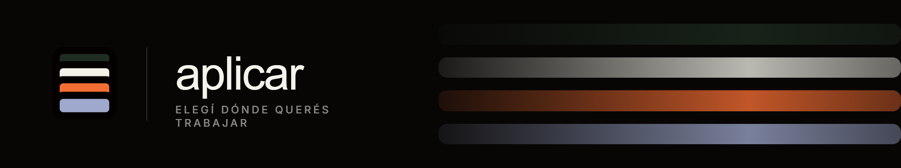

Hi!. My name is Luciano Rodriguez.

**GenAI Ssr Software Engineer at Mercado Libre** — Buenos Aires, Argentina.

I work on developer productivity across Mercado Libre, designing and shipping AI-powered tools that
adapt to how our engineering teams actually build software.

I'm in my final year of Systems Information Engineering at **UTN**, graduating in **2026**.

What drives me is building systems that improve people's quality of life. My long-term goal is to
become a reference in the GenAI field: I research continuously and keep up with what the industry is
shipping, so that knowledge turns into tools people actually use.

## Currently building

**[Ágora](https://www.agorasynth.com/)** — My university thesis: a platform that validates business ideas through simulated focus
groups, run by synthetic agents built on synthetic data. Instead of waiting weeks for real panel
research, you get a structured, multi-perspective read on your idea in minutes. Multi-agent
orchestration, RAG, synthetic data generation and LLM evaluation.

**[Aplicar](https://www.aplicarapp.com/)** — A job-hunting platform for the Argentine market: it finds relevant openings and applies
for you, adapting your profile, CV and cover letter to each role so you show up as the strongest
possible candidate. Node.js, TypeScript, Express, Supabase, LLM agents, scraping and ATS autofill.

## Speaking and writing

- **Mercado Libre** — Talk: in-house GenAI tooling and how to use it across the development
  lifecycle, with over 4,000 viewers
- **Crecimiento** — Workshop: best practices for building software with GenAI
- **Crecimiento** — Workshop: **Spec-Driven Development (SDD)** as a key differentiator for writing
  scalable, maintainable software
- **Crecimiento** — Talk: software architecture and how to treat AI as one more component in a system's architecture

The two workshops at Crecimiento drew 40 attendees in total. I believe knowledge and communication are
the two most valuable skills today, so I also publish research, reports and notes on the tech industry
on X.

## Working with

- **Main stack** — Kotlin · Java · Spring Boot · C++
- **Also** — TypeScript · Python · Node.js
- **AI and data** — LLM agents · RAG · PostgreSQL · Supabase · Docker

## Contact

lualejorodriguez26@gmail.com

<!-- Reemplazá los placeholders por tus handles y descomentá las líneas que quieras publicar:
[LinkedIn](https://www.linkedin.com/in/TU-USUARIO/) · [X](https://x.com/TU-USUARIO)
-->

<b>Español</b>

 

Soy **GenAI Software Engineer en Mercado Libre**, en Buenos Aires, Argentina.

Trabajo en mejorar la productividad de desarrollo en toda la compañía: diseño y construyo
herramientas con IA que se adaptan a las necesidades reales de los equipos de ingeniería de
Mercado Libre.

Estoy cursando el último año de Ingeniería en Sistemas de Información en la **UTN** y espero
recibirme en **2026**.

Lo que me mueve es construir sistemas que mejoren la calidad de vida de las personas. Mi visión a
largo plazo es ser un referente en el área de GenAI: investigo constantemente y me mantengo al día
con las últimas novedades de la industria, para convertir ese conocimiento en herramientas que la
gente use de verdad.

### En qué estoy trabajando

**[Ágora](https://www.agorasynth.com/)** — Mi tesis y proyecto final de la universidad: una plataforma que valida ideas de negocio
mediante focus groups simulados, con agentes sintéticos construidos sobre datos sintéticos. En lugar
de esperar semanas por un panel real, obtenés una lectura estructurada y multi-perspectiva de tu idea
en minutos. Orquestación multi-agente, RAG, generación de datos sintéticos y evaluación de LLMs.

**[Aplicar](https://www.aplicarapp.com/)** — Una plataforma de búsqueda laboral para el mercado argentino: encuentra ofertas
relevantes y se postula por vos, adaptando tu perfil, CV y carta de presentación a cada puesto para
que llegues como el mejor candidato posible. Node.js, TypeScript, Express, Supabase, agentes LLM,
scraping y autofill de ATS.

### Charlas y publicaciones

- **Mercado Libre** — Charla: herramientas GenAI desarrolladas in-house y cómo usarlas en el ciclo
  de desarrollo, con más de 4.000 espectadores
- **Crecimiento** — Workshop: buenas prácticas para desarrollar software con GenAI
- **Crecimiento** — Workshop: **SDD (Spec-Driven Development)** como concepto clave y diferenciador
  para generar software escalable y mantenible
- **Crecimiento** — Charla: arquitectura de software y cómo usar la IA como un componente más dentro
  de la arquitectura de un sistema

Los dos workshops en Crecimiento reunieron 40 asistentes en total. Considero que el conocimiento y la
comunicación son las dos habilidades con más valor hoy en día, así que también publico investigaciones,
informes y contenido sobre la industria tecnológica en X.

### Tecnologías

- **Stack principal** — Kotlin · Java · Spring Boot · C++
- **También** — TypeScript · Python · Node.js
- **IA y datos** — agentes LLM · RAG · PostgreSQL · Supabase · Docker

